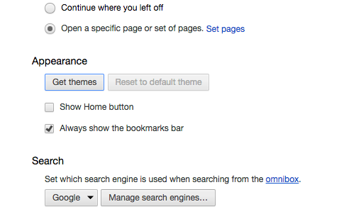

### Google Chrome

#### Introduction

Google Chrome is a web browser developed by Google. You may already have Chrome installed, however, if you don’t, we are going to do it now.

### Installation

Go to [the Google Chrome website](https://www.google.com/chrome/) and click on the Download Chrome button. It will automatically detect your OS and provide a proper edition for your system.

In the dialogue box, click on accept and install. A compressed file will then be downloaded from the site.

Click on it and follow the installation instructions.

### Features

**Google Chrome** has many advantages:

It provides private browsing - prevents the browser from permanently storing any history information or cookies from the websites visited
It has a huge ecosystem of extensions (plug-ins) and themes - These can change the appearance of your browser, or add cool functionality that isn’t natively supported.
It keeps up to date with the latest technologies - Not all browsers render HTML / CSS / JavaScript in the same way. Technologies are constantly evolving, and some browsers are better at keeping up with it than others. Chrome is top tier in this regard.

### Themes

You can add themes by clicking on **Chrome > Preferences** or by typing `Cmd⌘ +`, and opening the Chrome settings view. The third tab, **‘Settings’** displays the appearence options. To change the theme just click on **Get themes** under \*_Appearance_.

### Extensions

This is one of the best features of Chrome. Extensions or plug-ins are packages to add features onto your browser. You can install and enable them by clicking on the Extensions tab of the Settings view.

Here you will find a list of very useful plug-ins for your browser:

👉 [Octotree](https://chrome.google.com/webstore/detail/octotree/bkhaagjahfmjljalopjnoealnfndnagc)

- It provides a code tree for GitHub projects. You can explore a project’s source code online without having to pull the project repository.

👉 [**Pocket**](https://chrome.google.com/webstore/detail/save-to-pocket/niloccemoadcdkdjlinkgdfekeahmflj?hl=en)

- With Pocket, you can save articles, videos, recipes, and webpages you find online without using bookmarks.

👉 [JSONView](https://chrome.google.com/webstore/detail/jsonview/chklaanhfefbnpoihckbnefhakgolnmc?hl=en)

- It allows you to view and validate JSON documents on Chrome easily. (Will be incredibly useful later)

👉 [Dark Theme Dev Tools](https://chrome.google.com/webstore/detail/devtools-theme-zero-dark/bomhdjeadceaggdgfoefmpeafkjhegbo)

- This extension is for Google Chrome Dev Tools. It provides a highly customizable dark theme for Dev Tools if you want to give a personal and dark touch to your Google Chrome Dev Tools suite.

ℹ️ Google Chrome is just one of many web browsers. It’s one of the best, with great extensions, useful developer tools, and a great ecosystem. There are tons of settings and neat tricks Chrome has hidden away, so feel free to explore, as it will be one of many web developer tools you will be using in the future.
