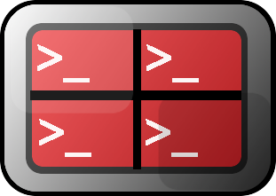

### Terminal Setup

#### Introduction: Terminal emulators

👉 Terminal emulators provide text-based access to the operating system (in contrast to the mostly graphical nature of the user experience of any Operating System, which is managed with your mouse/trackpad).

---

## 🔴IMPORTANT❗

### **_NOTE:_** ⚠️ A Warning ⚠️

#### 👉 ❗️ Before continuing please note that you will see commands prefaced with `$` . For example:

```bash

irene-terminal $ mkdir  js-workshop
$ cd js-workshop
$ code .

```

#### 🤔 👉 ❗️ The dollar sign denotes the command will be entered into the terminal. You do not need to type it.

###

---


Terminal is the terminal emulator included in the OS X operating system by Apple.


**iTerm2** is a a free replacement for the **OSX terminal** (the default terminal emulator in Apple’s Operating System).

🤔 You may wonder why would we need iTerm2 if we already have a terminal installed.

🛑 **iTerm2** offers us a **host** of extra features we can configure to give us a better experience.

#### Some examples of cool features are:

👉 Split panel view.

👉Hot-key window for instant terminal anywhere.

👉 Mouseless copy.

👉 Along with many more that we’ll learn about later on in this chapter.

### 🛑 Installation

👉 Go to the [downloads](https://www.iterm2.com/downloads.html) page.

👉 Download the Stable Release.

👉 Decompress the zip file.

👉 In Finder, drag-and-drop the iTerm2 Application file into the Applications folder.

👉Launch iTerm2 by looking for it in the Spotlight Search or clicking on its icon in the App Launcher.

### Terminator (Linux Only!)



Like in OS X, Terminal is the emulator included in most Linux operating systems. It is the **command-line interface** through which you can type in commands and carry out other text manipulation on Linux.
The **terminal** is a very indispensable tool for system administration. And there are some times when you’d do most of your work on the command-line, like if you are a server admin or programmer.
👉 Install the alternative one called **Terminator**.

**Terminator** was originally created and developed by Chris Jones. Nowadays, it is one of the most popular **terminal emulators** in the **Ubuntu** community.

👉 **Terminator** is a an alternative terminal for **Linux** that comes with a little additional features and functionality that you wont find in the default terminal application.

👉 For instance in terminator you can split your terminal screen both horizontally and vertically as you wish.
👉 The user can also have multiple terminals in one window and use custom key bindings to switch between them.

👉 With terminator a power user can efficiently fill a large area of screen space with terminals.

### Intallation

To install terminator, run the following command:

```js
$ sudo apt-get update
$ sudo apt-get install terminator
```

> :warning:🛑 **Remember, we don’t have to type the **`$`\*\*
> So, for:
>
> ```js
> $ sudo apt-get update
> ```
>
> You only have to write **`sudo apt-get update`**.

Be very careful here!

### To UNINSTALL Terminator

```js
sudo apt remove terminator
```

##### Uninstall terminator and its dependencies (which are no longer needed):

```js
sudo apt remove --auto-remove terminator
```
